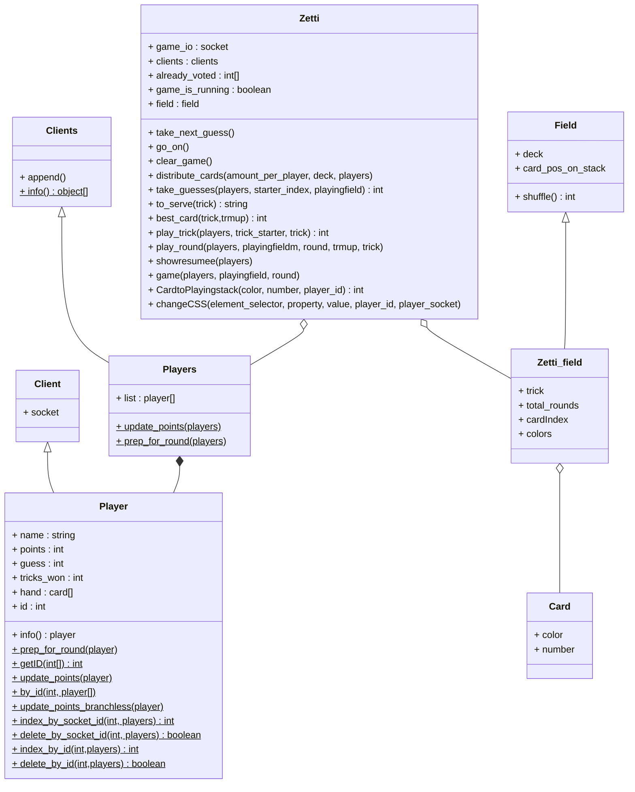

# README


## get it running (on linux)

If the server is installed on an alpine container do some of the following:

```sh
apk update
apk add nodejs git

adduser zetti
su zetti
cd ~

git clone git@github.com:TR0N-ZEN/Zetti.git
cd ~/Zetti/server/
npm install
node main.js server

```


## architecture

I stop descriibing this because maintaining it in parallel to the code costs fkn time.  
Using vscode u can use shortcut **Focus Breadcrumbs** to observe the structure of datatypes.  

