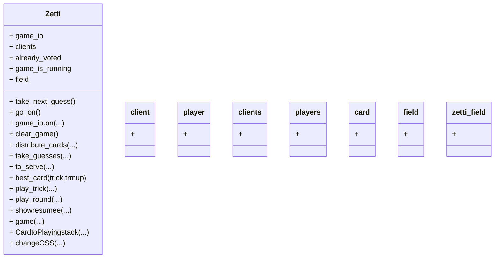

# README


## get it running (on linux)

If the server is installed on an alpine container do some of the following:

```sh
apk update
apk add nodejs git

adduser zetti
su zetti
cd ~

git clone git@github.com:TR0N-ZEN/Zetti.git
cd ~/Zetti/server/
npm install
node main.js server

```


## architecture

